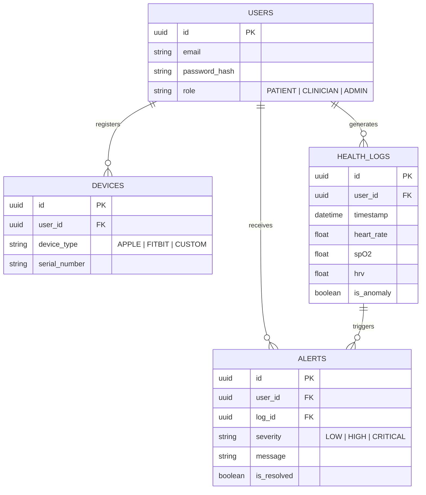

# ER Diagram – MediSync

```mermaid
erDiagram

    USERS {
        uuid id PK
        string email
        string password_hash
        string role "PATIENT | CLINICIAN | ADMIN"
    }

    DEVICES {
        uuid id PK
        uuid user_id FK
        string device_type "APPLE | FITBIT | CUSTOM"
        string serial_number
    }

    HEALTH_LOGS {
        uuid id PK
        uuid user_id FK
        datetime timestamp
        float heart_rate
        float spO2
        float hrv
        boolean is_anomaly
    }

    ALERTS {
        uuid id PK
        uuid user_id FK
        uuid log_id FK
        string severity "LOW | HIGH | CRITICAL"
        string message
        boolean is_resolved
    }

    USERS ||--o{ DEVICES : "registers"
    USERS ||--o{ HEALTH_LOGS : "generates"
    USERS ||--o{ ALERTS : "receives"
    HEALTH_LOGS ||--o{ ALERTS : "triggers"
```
