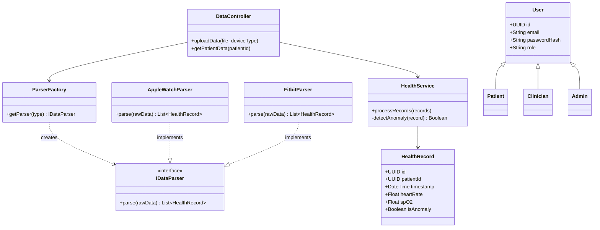

# Class Diagram – MediSync

```mermaid
classDiagram

    class DataController {
        +uploadData(file, deviceType)
        +getPatientData(patientId)
    }

    class ParserFactory {
        +getParser(type) IDataParser
    }

    class IDataParser {
        <<interface>>
        +parse(rawData) List~HealthRecord~
    }

    class AppleWatchParser {
        +parse(rawData) List~HealthRecord~
    }

    class FitbitParser {
        +parse(rawData) List~HealthRecord~
    }

    class HealthService {
        +processRecords(records)
        -detectAnomaly(record) Boolean
    }

    class HealthRecord {
        +UUID id
        +UUID patientId
        +DateTime timestamp
        +Float heartRate
        +Float spO2
        +Boolean isAnomaly
    }

    class User {
        +UUID id
        +String email
        +String passwordHash
        +String role
    }

    class Patient {
    }

    class Clinician {
    }

    class Admin {
    }

    User <|-- Patient
    User <|-- Clinician
    User <|-- Admin

    DataController --> ParserFactory
    ParserFactory ..> IDataParser : creates
    AppleWatchParser ..|> IDataParser : implements
    FitbitParser ..|> IDataParser : implements
    DataController --> HealthService
    HealthService --> HealthRecord
```
