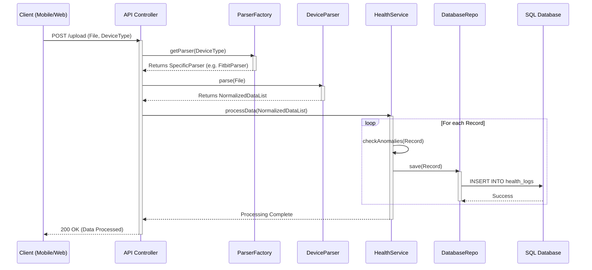

# Sequence Diagram – Health Data Upload Flow

```mermaid
sequenceDiagram
    participant Client as Client (Mobile/Web)
    participant API as API Controller
    participant Factory as ParserFactory
    participant Parser as DeviceParser
    participant Service as HealthService
    participant Repo as DatabaseRepo
    participant DB as SQL Database

    Client->>API: POST /upload (File, DeviceType)
    activate API

    API->>Factory: getParser(DeviceType)
    activate Factory
    Factory-->>API: Returns SpecificParser (e.g. FitbitParser)
    deactivate Factory

    API->>Parser: parse(File)
    activate Parser
    Parser-->>API: Returns NormalizedDataList
    deactivate Parser

    API->>Service: processData(NormalizedDataList)
    activate Service

    loop For each Record
        Service->>Service: checkAnomalies(Record)
        Service->>Repo: save(Record)
        activate Repo
        Repo->>DB: INSERT INTO health_logs
        DB-->>Repo: Success
        deactivate Repo
    end

    Service-->>API: Processing Complete
    deactivate Service

    API-->>Client: 200 OK (Data Processed)
    deactivate API
```
