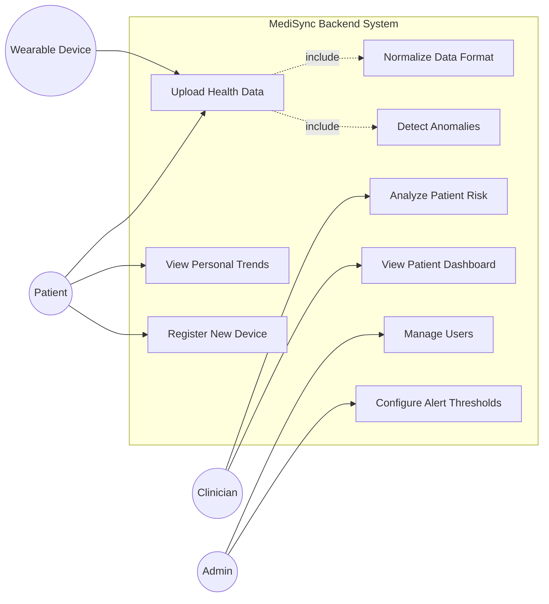

# Use Case Diagram – MediSync

```mermaid
flowchart LR

    Patient((Patient))
    Clinician((Clinician))
    Admin((Admin))
    Device((Wearable Device))

    subgraph MediSync["MediSync Backend System"]
        UC1[Upload Health Data]
        UC2[View Personal Trends]
        UC3[Register New Device]
        UC4[Analyze Patient Risk]
        UC5[View Patient Dashboard]
        UC6[Manage Users]
        UC7[Configure Alert Thresholds]
        UC8[Normalize Data Format]
        UC9[Detect Anomalies]
    end

    Patient --> UC1
    Patient --> UC2
    Patient --> UC3
    Device --> UC1

    Clinician --> UC4
    Clinician --> UC5

    Admin --> UC6
    Admin --> UC7

    UC1 -.->|include| UC8
    UC1 -.->|include| UC9
```
